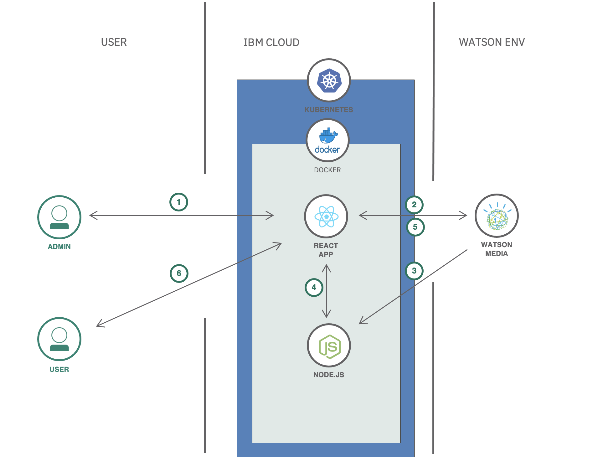
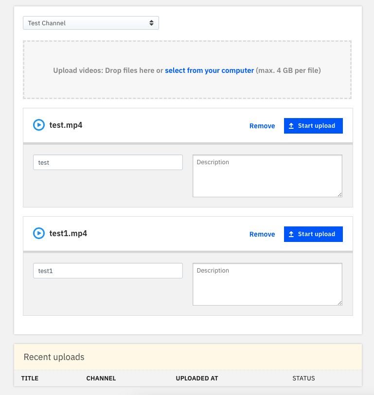
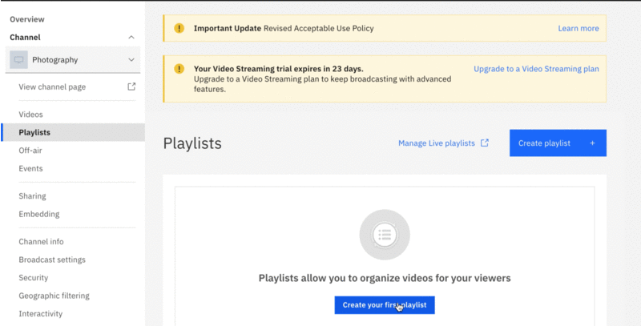
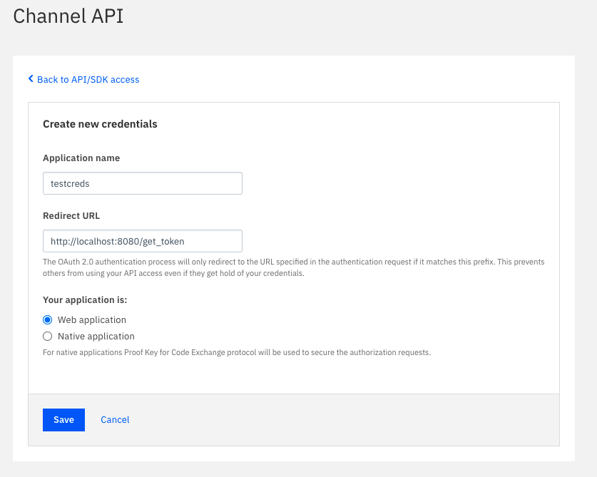
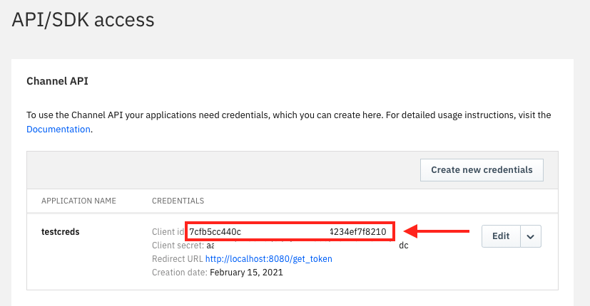
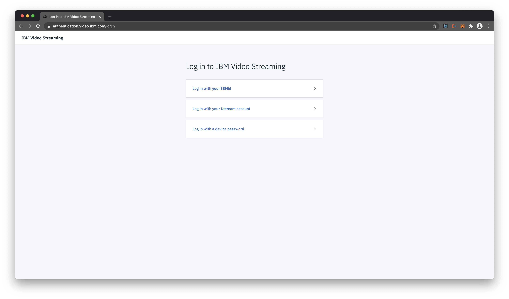
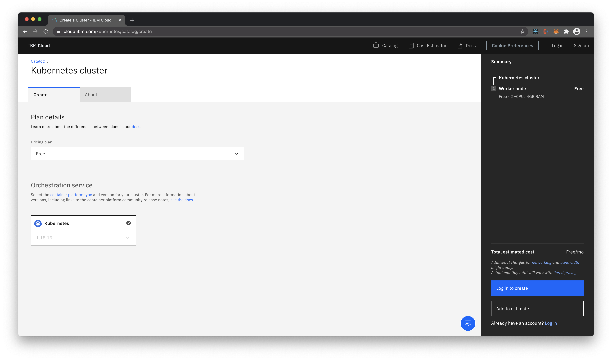
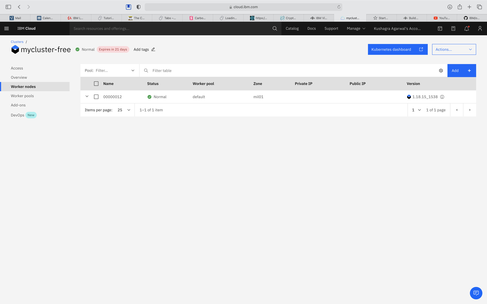
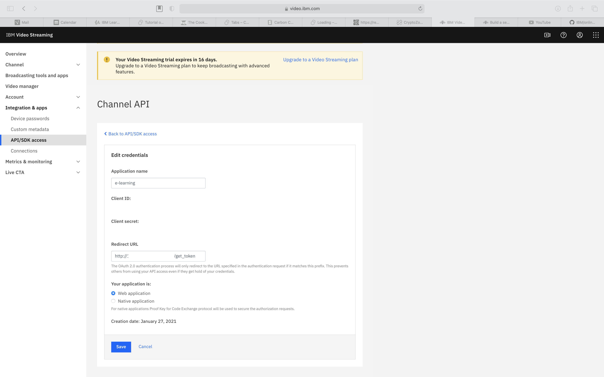

# Build an e-learning portal with Watson Media.

The COVID pandemic has altered our conventional ways of working in companies, startups, businesses, and Educational Institutes were no different. In the current times, to maintain social distancing, Schools and Colleges are choosing the e-learning platforms to impart education. Though, it started as a  precautionary measure to stop the further spread of the pandemic. But it is turning into a much more effective and efficient mode of teaching in terms of resources. More and more startups are emerging in the educational domain to make use of this window of opportunity.  Therefore, IBM brings forth `IBM Watson Media` to the developer community, which provides almost everything they need to build an e-learning platform for their startup. 

[IBM Watson Media](https://www.ibm.com/watson/media) offers AI-driven solutions for live streaming events, corporate communication, video analytics, and content management. This Comprehensive video streaming platform provides Live stream and auto-archive for video-on-demand viewing to boost overall reach and engagement. Use IBM Watson Media solutions to stream events, executive town halls, video marketing product launches, and entertainment OTT (over-the-top) streaming. Built for scale and reliability, to optimize video quality, and powered by IBM Watson AI for video search and automated closed captioning, our video solutions are used by thousands of enterprises, service providers, educators, and media companies worldwide to improve video workflows, reliability and content monetization.

```
>> [MJ] This paragraph is copied as it is from https://www.ibm.com/watson/media which will bring down the NPS score. 
Hence you can simple write a few lines in your own words or you can say learn more about watson media here and give the above link.
```

In this code pattern, we will demonstrate how to quickly build an `e-learning portal` using `Watson Media`.
```
>> [MJ] Edit the above sentence as -
After completing the code pattern, you understand how to:

followed by the 5 points that you have mentioned.
```
The Scope of this Code Pattern is limited to following capabilities. `However, the Solutions can be scaled to accomodate a lot more functionalities andd capabilities through the Services, Products, Solutions and APIs provided by Watson Media.`  

```
>> [MJ] Move this paragraph below the 5 points.
```

- Create channels for different areas of learning. 
- Create and upload videos for a channel.
- Password restrict the access to videos.
- Restrict domains where the video can be embedded.
- Build a web application with authentication to access the channels using the APIs provided by Watson Media. 

### Flow



1. Admin requests to authorizes app in `/admin`
```
>> [MJ] remove the /admin and just say app.
```
2. App redirects admin to IBM OAuth2.0 portal.
```
>> [MJ] you can say App is authorized through OAuth2.0 portal.
```
3. Node Server receives Auth token from Watson Media.
4. App requests server for the auth token
5. App uses auth token to create dashboard for user on runtime.
6. User logs in and accesses content.
```
>> [MJ] User logs in and accesses content published on Watson Media.
```

### Included components

* [IBM Watson Media](https://www.ibm.com/watson/media): It offers AI-driven solutions for live streaming events, corporate communication, video analytics, and content management.
* [Kubernetes](https://cloud.ibm.com/kubernetes/catalog/create): IBM Cloud Kubernetes Service creates a cluster of compute hosts and deploys highly available containers. A Kubernetes cluster lets you securely manage the resources that you need to quickly deploy, update, and scale applications.

### Featured technologies

* [Node.js](https://nodejs.org/en/): An asynchronous event driven JavaScript runtime, designed to build scalable applications
* [React](https://reactjs.org/): Javascript library for building User Interfaces
* [Docker](https://www.docker.com/why-docker): Docker is a set of platform as a service products that use OS-level virtualization to deliver software in packages called containers.


### Watch the Video

[

```
>> [MJ] you can comment this section and just say coming soon if you are planning to add the video.
```

### Steps
1. [Login using IBMID on IBM Watson Media.](#1-login-using-ibmid-on-ibm-watson-media)
1. [Create the Channels.](#2-create-the-channels)
1. [Upload Videos on the Channel.](#3-upload-videos-on-the-channel)
1. [Create Playlists.](#4-create-playlists)
1. [Give Password Restriction on the Channel.](#5-give-password-restriction-on-the-channel)
1. [Restrict Domains where video can be embedded.](#6-restrict-domains-where-video-can-be-embedded)
1. [Build a web appplication using Channel API.](#7-build-a-web-appplication-using-channel-api)
    * 7.1 [Generate Channel API credentials](#71-generate-channel-api-credentials)
    * 7.2 [Build React UI](#72-build-react-ui)
    * 7.3 [Move build to node directory.](#73-move-build-to-node-directory)
    * 7.4 [Install Node modules.](#74-install-node-modules)
    * 7.5 [Deploy the Application.](#75-deploy-the-application)


## 1. Login using IBMID on IBM Watson Media.
If you don't have IBM ID,  create an account on IBM Cloud Account 
- Login to [IBM CLOUD](https://cloud.ibm.com/login).

using the same ID, 
* Click on Free Trial on [Watson Media Page](https://www.ibm.com/watson/media/services)
```
>> [MJ] Check this URL, I don’t see Free Trial option on this page. Probably its this URL: https://www.ibm.com/watson/media
```
* Login using IBM ID. Your 30 days free trial of the product will be activated. 


## 2. Create the Channels.
```
>> [MJ] Explain a little bit about channels, why are we creating them what purpose do they solve etc..
this is just to give a background for non technical people trying to execute the code pattern.
```
* Click on `Create Channel`.

```
>> [MJ] buttons, links, titles, etc should be like this **Create Channel**
and any configurations like api, credentials.json etc should be in back quotes
Ex: `credentials.json` hence change this everywhere wherever necessary.
```

  ```
  Note: Free Trial allows you to create only one channel, you need to upgrade to premium account to create more.
  ```
* Give the `Channel Name.` 

``` 
>> [MJ] There is no channel name field, there is a title field
hence change it to something like this:

In the **Title** field, enter your channel name, and under **Language of videos and broadcasts**,
select your desired language, finally click on **Create** as shown.

```

* Select the `Language` from the dropdown 
* Hit `Create` button. 


* To View `Channel Page`, click on the `view Channel Page`

```
>> [MJ] You can put this under note.
>Note: You can view the **Channel Page** by clicking on the **View Channel Page** in the left panel.
```

## 3. Upload Videos on the Channel.
* Click on `Videos Button` on the left-hand side Dashboard. 
``` 
>> [MJ] Click on **Videos** in the left panel
``` 
* Click `upload` button.

```
>> [MJ] Click on the **Upload your first video** button.
``` 

* Select all the files you want to upload from the computer and click `open`.

``` 
>> [MJ] Select all the files you want to upload from the computer, 
you can also give it a name and description and click on **Start Upload** button to upload the video on Watson Media.
attach this screenshot here: 
```
 
```
Give a note here saying "Uploading videos will take some time based on your internet bandwidth,
please be patient for the upload to complete and watson media to process it."
``` 

``` 
>> [MJ] Also say that maximum 500GB storage is available in lite plan.
``` 

```
>> [MJ] Also are we not providing any sample video files here?
```
* Click `Start to Upload` Button. 
* After the upload is complete, Go back to Dashboard, under Videos section, Select all the uploaded videos and Hit Publish. 

``` 
>> [MJ] Go back to Dashboard, click on **Channel > Videos**, select all the uploaded videos and Hit Publish.
``` 
    


```
>> [MJ] The Gif seems to be fast, probably you can just keep the images individually rather than a gif or you can try a simple tool called giphy capture (https://giphy.com/apps/giphycapture) to capture gifs.
```
``` 
>> [MJ] Add this point: * You will see a message popup saying the selected videos are published.
``` 


## 4. Create Playlists.

```
>> [MJ] Again Explain what is a playlist, how they work. Just few lines should be enough
this is again to give a background for non technical people trying to execute the code pattern.
```

* Click on `Playlist Button` on the left-hand side Dashboard. 
``` 
>> [MJ] Click on **Playlist** in the left panel
``` 
* Click `Create Playlist` button.
* Give Playlist Name
``` 
>> [MJ] There is no playlist name field, there is a title field
hence change it to something like this:

In the **Title** field, enter your playlist name, and click on **Create playlist** as shown.
```

* Add Videos to the playlist and Hit `create button` 

``` 
>> [MJ] Add this point: * You will see a message popup saying the selected videos are published.
``` 




```
>> [MJ] The Gif seems to be fast, probably you can just keep the images individually rather than a gif or you can try a simple tool called giphy capture (https://giphy.com/apps/giphycapture) to capture gifs.
```

## 5. Give Password Restriction on the Channel.
``` 
>> [MJ] Explain why is this an important feature and how will it help the content creators, in few lines should be good enough.
``` 
* On the Dashboard, Click on `Security` Tab on the left-side panel.

* Click on `Password Protection`
``` 
>> [MJ] Click on **settings** next to **Password Protection**.
``` 
* Checkmark the `Enable Password Protection` button.
* Give the Channel Password of your choice and hit `save`. 


## 6. Restrict Domains where video can be embedded.
``` 
>> [MJ] Again explain why is this an important feature and how will it help the content creators, in few lines should be good enough.
``` 
* On the Dashboard, Click on `Security` Tab on the left-side panel.
* Click on `Embed Restriction`
``` 
>> [MJ] Click on **settings** next to **Restrict embed URLs**.
``` 
* Checkmark the `specify the domains where your streams can be embedded ` button.
* Give the domains where you want to allow or restrict and hit `save`. 
``` 
>> [MJ] This domain will be available only after the application is deployed on kubernetes hence this step should be after step 7.
``` 


## 7. Build a web appplication using Channel API.

``` 
>> [MJ] You can give a brief introduction of what this app is doing, what is its purpose on a high level.
(dont use technical jargons simple explaination in few words should be fine.)
``` 

  ### 7.1 Generate Channel API credentials
  * On Watson Media, Try it for free, sign up and get to the developers dashboard.
  ``` 
  >> [MJ] At this point in documentation the user is already in dashboard so you can remove this point.
  ``` 
  * From the left navigation bar click on **API/SDK Access**.
  ``` 
  >> [MJ] At some places its being called left-side panel, left-hand side, left navigation. Please call it left panel throughout.
  also it should be click on **Integration & apps > API/SDK Access**
  Add this point:
  * you will be asked to login, click on **login with your IBMid**
  
  ``` 
  * Click **Create New Credentials** to create Channel API credentials.
  ``` 
  >> [MJ] Click on **Create credentials** to create Channel API credentials.
  ``` 
  * Enter a **Application Name** as per choice.
  ``` 
  >> [MJ]Enter an **Application Name** as per choice.
  ``` 
  * Enter a **Application Name** as per choice.
  * Enter http://localhost:8080/get_token as the Redirect URL.
  * Select **Web Application** from the radio as the application type.
  * Click Save and copy the **Client ID**.
  ``` 
  >> [MJ] Click on Save. 
  After this add the below screenshot:
  ``` 
  
  ``` 
  >> [MJ] Add this point:
  * Once the credentials are created copy the `Client id` as it will be required in the next step.
  and add this screenshot:
  ```
  

  ### 7.2 Build React UI
  
  ``` 
  >> [MJ] Why are we building React UI? is it not already built and placed in NodeJs directory?
  ``` 
  
  Go to the directory on your local system where you cloned the repository and go inside the `React UI` folder and run the following command on your terminal.
  
  ``` 
  >> [MJ] you can simply say: In the repo parent folder, go to `/React UI` 
  ``` 
  
  ```bash
  npm run build
  ```
  
  ``` 
  >> [MJ] add cd Build-an-elearning-portal-with-Watson-Media/ before npm run build
  ``` 

  ### 7.3 Move build to node directory
  
  ``` 
  >> [MJ] These steps are part of Building React UI hence they may not be separate points. 
  If you want to make it separate points then nest them. example: 7.2.1, 7.2.2 rather than 7.3 and 7.4
  ``` 
  
  After creating the react build run the following command in your terminal in the same directory as the build folder.
  ```bash
  mv ./build ./../
  ```
  ### 7.4 Install Node Modules
  Inside the folder `watson-media-node` run the following command
  ```bash
  npm install
  ```

   ### 7.5 Deploy the Application
  <details><summary><b>Deploy Locally</b></summary>

  * After node modules have been installed run the following command 
  ```bash
  node server.js
  ```
  After this the application is listening on http://localhost:8080/

  * Open your Web Browser and visit http://localhost:8080 .You will be redirected to http://localhost:8080/admin . Here enter the Client ID that you previously copied. and click **Authorize.**
  

  * This will redirect you to Watson Media OAuth and you will be required to login with your W3, UStream or Device Credentials. After logging in, click **Authorize.**
  
  

  * Successful Authentication will redirect you to http://localhost:8080/login . 
  Here the user is required to enter the login credentials managed by the developer. For demonstration we are using the credentials stored in `React UI/src/content/sampleLogin.json`.
  Look them up and enter it in the text boxes on `/login` and click Login.
  

  * After successfully logging in you can now view the different channels and videos and playlists uploaded in them.
  
  


  </details>
  <details><summary><b>Deploy on Kubernetes</b></summary>

  #### Create a free Kubernetes Cluster on IBM Cloud

  * Create a free Kubernetes Cluster Account on https://cloud.ibm.com/kubernetes/catalog/create
  

  * Connect your terminal to IBM Cloud using the following commands
  

  * Click on worker nodes in the left navigation bar and copy your public IP.
  


  #### Build and push Docker Image to Docker Hub.
  * Inside the directory `watson-media-node` run the following command
  ```bash
  docker build -t <DOCKERHUB_USERNAME>/<IMAGE_NAME>:<TAG> .
  ```

  The command should look like this
  ```bash
  docker build -t randomUser/watson-media-node:v2 .
  ```

  * After docker image is built, push it to docker hub using the following command
  ```bash
  docker push <DOCKERHUB_USERNAME>/<IMAGE_NAME>:<TAG> 
  ```

  * Inside the directory `watson-media-node`, change `deploy.yaml` file replace line no. 17 to
  ```bash
  image : <DOCKERHUB_USERNAME>/<IMAGE_NAME>:<TAG>
  ```
  It should look something like this 
  ```bash
  image: randomUser/watson-node-elearning:v2
  ```

  #### Deploy on Kubernetes

  * Next run the following command to deploy the image to kubernetes.
  ```bash
  kubectl apply -f deploy.yaml
  ```
  The Application is now running on your kubernetes node.

  * Go to your Watson Media API/SDK Access Dashboard and change the Redirect URL to http://<YOUR_KUBERNETES_NODE_PUBLIC_IP>:32423/get_token

  


  >NOTE: We have entered **32423** as this is the one that we have exposed in out `deploy.yaml` file.

  </details>


## License

This code pattern is licensed under the Apache License, Version 2. Separate third-party code objects invoked within this code pattern are licensed by their respective providers pursuant to their own separate licenses. Contributions are subject to the [Developer Certificate of Origin, Version 1.1](https://developercertificate.org/) and the [Apache License, Version 2](https://www.apache.org/licenses/LICENSE-2.0.txt).

[Apache License FAQ](https://www.apache.org/foundation/license-faq.html#WhatDoesItMEAN)
